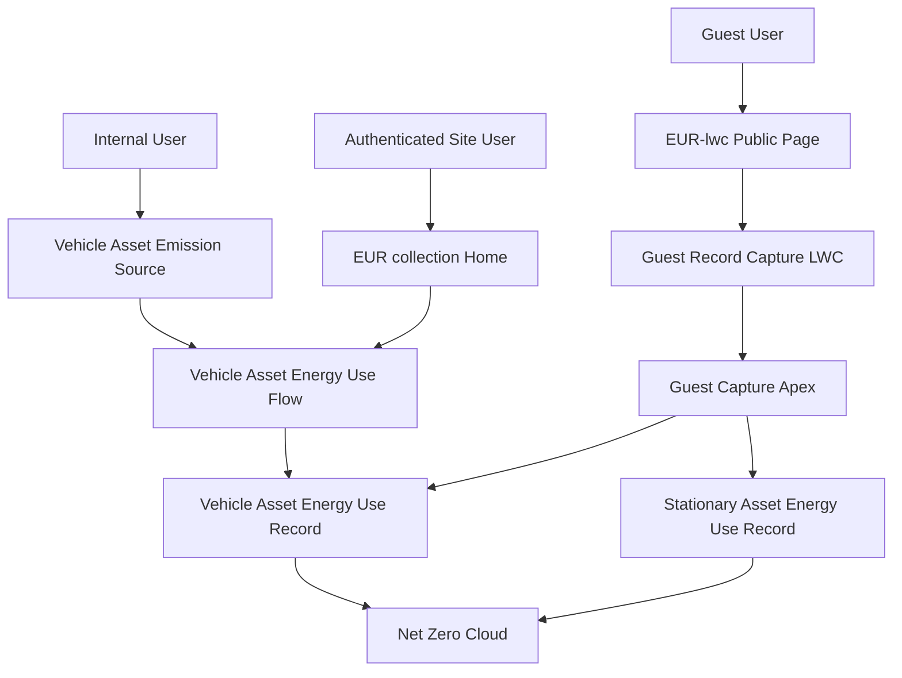

# 🚗 Vehicle Asset Energy Use (NZC)

> **A Net Zero Cloud accelerator that captures vehicle fuel and energy use through a guided screen flow internally, and a reusable guest Lightning web component on Experience Cloud for unauthenticated Energy Use Record collection**

[](https://salesforce.com)
[](https://help.salesforce.com/s/articleView?id=sf.netzero_cloud_intro.htm)
[](https://developer.salesforce.com/docs/platform/lwc/guide)

## 🚀 Quick Deploy

<div align="center">

[](https://githubsfdeploy.herokuapp.com?owner=carlosvl&repo=VehicleEnergyUseFlow-NZC&ref=deploy-mdapi)

**One-click deployment to your Salesforce org**

> **Note:** You'll be prompted to authenticate with your Salesforce org. Digital Experiences must be enabled in the target org before the Experience Cloud site can deploy. Alternatively, use the [Salesforce CLI deployment method](#-option-3-salesforce-cli-deployment) below.

</div>

---

## ✨ Features

### 🚙 **Vehicle Energy Capture**

- **Guided Screen Flow**: Walks users through fuel type, consumption, efficiency, date range, and other emissions factor selection
- **Vehicle Asset Alignment**: Creates `VehicleAssetEnrgyUse` records against a Vehicle Asset Emission Source, the vehicle counterpart to Net Zero Cloud's stationary energy capture
- **Picklist-Driven Units**: Uses org picklists for fuel type, fuel consumption unit, and fuel efficiency unit so values stay consistent with Net Zero Cloud

### 🌐 **External Collection**

- **Experience Cloud Site**: Includes the **EUR collection** LWR site so partners, community users, and guests can submit Energy Use Records
- **Guest LWC on EUR-lwc**: Public `/eur-lwc` hosts the config-driven **Guest Record Capture** component twice (vehicle `Vehicle_Energy_Use` and stationary `Stationary_Energy_Use`) so guests search a parent asset and create an energy use record without the flow
- **Branded Workspace**: Ships network settings and branding for the collection community
- **Authenticated + Public Access**: Site is configured for authenticated users with public access enabled; Home keeps the screen flow for members

### 🏗️ **Net Zero Cloud Integration**

- **Standard Objects Only**: Writes to Net Zero Cloud vehicle energy-use objects — no custom objects required
- **Emissions Factor**: The internal flow collects Other Emissions Factor Set on each submission. Guest capture copies that lookup from the selected parent asset so carbon accounting can proceed downstream
- **Stationary Counterpart**: Complements the managed **Collect Energy Use Data** flow that ships with Net Zero Cloud for Stationary Assets

---

## 🚀 Getting Started

### 📋 Prerequisites

Before you begin, ensure you have the following:

- ✅ **Salesforce Net Zero Cloud** licensed and configured (Vehicle Asset Energy Use and Vehicle Asset Emission Source available)
- ✅ **Digital Experiences** enabled if you plan to use the EUR collection site (Setup → Digital Experiences → Settings)
- ✅ **Git** installed on your local machine (for CLI deployment)
- ✅ **Salesforce CLI** (latest version recommended) - [Download here](https://developer.salesforce.com/tools/salesforcecli)
- ✅ **Salesforce user** with deployment permissions (System Administrator or equivalent)
- ✅ **Active Salesforce org** (Sandbox, Developer Edition, or Production)

### 🔧 Installation

Choose your preferred deployment method:

#### 🎯 Option 1: One-Click GitHub Deploy _(Recommended)_

Click the **"Deploy to Salesforce"** button above for instant deployment to your org.

#### 📦 Option 2: Workbench Deployment

For environments where GitHub access is restricted:

1. **Download** the pre-built deployment package:
   - Direct download: [VehicleEnergyUseFlow-NZC-Deploy.zip](https://github.com/carlosvl/VehicleEnergyUseFlow-NZC/releases/latest/download/VehicleEnergyUseFlow-NZC-Deploy.zip)
   - Or download from the [GitHub Releases](https://github.com/carlosvl/VehicleEnergyUseFlow-NZC/releases) tab
2. **Navigate** to [Salesforce Workbench](https://workbench.developerforce.com/login.php)
3. **Login** to your target org
4. **Go to** Migration → Deploy
5. **Upload** the zip file and deploy

**Alternative Tools:** You can also deploy using [Salesforce Inspector](https://chrome.google.com/webstore/detail/salesforce-inspector/aodjmnfhjibkcdimpodiifdjnnncaafh) or the [Ant Migration Tool](https://developer.salesforce.com/docs/atlas.en-us.daas.meta/daas/forcemigrationtool_install.htm).

#### 🛠️ Option 3: Salesforce CLI Deployment

For developers who prefer command-line tools:

##### 3.1 Clone the Repository

```bash
git clone https://github.com/carlosvl/VehicleEnergyUseFlow-NZC.git
cd VehicleEnergyUseFlow-NZC
```

##### 3.2 Authorize Your Org

```bash
# For sandbox orgs
sf org login web --alias MyOrg --instance-url https://test.salesforce.com

# For developer or production orgs
sf org login web --alias MyOrg
```

##### 3.3 Deploy the Metadata

```bash
# Deploy all components (Salesforce CLI v2)
sf project deploy start --source-dir force-app --target-org MyOrg

# Or using legacy sfdx command
sfdx force:source:deploy -p force-app -u MyOrg
```

**Note:** This accelerator is compatible with CI/CD tools like Gearset, Copado, Flosum, and Salesforce DevOps Center.

#### ⚡ Post-Deployment Configuration

Deploying metadata does **not** finish the install. Sharing, guest APIs, Lightning page mapping, site publish, and licenses are **admin Setup**. Use the full checklist in **[docs/admin-setup/README.md](docs/admin-setup/README.md)**. Summary:

1. **Confirm Net Zero Cloud objects** and create **Other Emissions Factor Set** records (`OtherEmssnFctrSet`; there is no Other Emissions Factor object). Set `OtherEmssnFctrId` on every parent asset guests may select.

2. **Add the flow** to the Vehicle Asset Emission Source Lightning page. Map the page record Id to flow input **`RecordID`** (case-sensitive).

3. **Enable Digital Experiences**, set a verified **email sender**, remap Network member profiles (`nzc partner user` is org-specific), keep **EUR-lwc** public, and **publish** the site. After any later LWC deploy, publish again (`sf community publish --name "EUR collection"`) or guests keep stale webruntime JavaScript.

4. **Guest public APIs** — Experience Workspaces → Administration → Preferences → **Allow guest users to access public APIs**. This is not in source. Leave guest profile **API Enabled** unchecked.

5. **Guest access** — assign `Guest_Record_Capture` when the Guest User license includes Net Zero Cloud objects. Create **guest user sharing rules (Read only)** on `VehicleAssetEmssnSrc`, `StnryAssetEnvrSrc`, and `OtherEmssnFctrSet`. Create on energy-use objects is object permission, not sharing. Many Guest User licenses cannot CRUD these objects; then grant Apex + CMDT on the guest profile and use authenticated members for capture.

6. **Verify** Home (signed-in flow), public `/eur-lwc` (two Guest Record Capture cards), and that guest submit does not flash `REQUIRED_FIELD_MISSING`. If the org already has enhanced LWR, place the LWCs in Experience Builder instead of overlaying the repo ExperienceBundle.

Optionally add the companion [NZC LLM Bill Ingestor](https://github.com/carlosvl/NZC-LLM-Bill-Ingestor) on a different page. This site does not reference it.

---

## 🎯 Usage

### 📱 **Capture Energy Use from a Vehicle Asset**

1. **Open** a Vehicle Asset Emission Source record
2. **Run** the **Vehicle Asset Energy Use** flow (from the record page, a quick action, or Flow)
3. **Enter** Name, Other Emissions Factor, Fuel Type, Fuel Consumption, and Fuel Consumption Unit (required)
4. **Optionally enter** Start Date, End Date, Fuel Efficiency, and Fuel Efficiency Unit (defaults to miles per gallon)
5. **Finish** the flow to create a Vehicle Asset Energy Use record linked to that emission source

### 🌐 **Collect Records from the Experience Cloud Site**

**Authenticated (Home)**

1. **Share** the EUR collection site URL with partner or community users
2. **Sign in** as a user whose profile is a member of the site
3. **Complete** the **Vehicle Asset Energy Use** flow on Home
4. **Confirm** the new Vehicle Asset Energy Use record in Salesforce

**Guest (EUR-lwc)**

1. **Open** the public `/eur-lwc` page (no sign-in)
2. **Choose** the Vehicle energy use or Stationary energy use card
3. **Search** for the matching parent asset (at least 3 characters)
4. **Fill** Name, fuel type, consumption, and unit (dates are optional; vehicle also has optional efficiency). Other Emissions Factor is copied from the asset.
5. **Submit** to create the energy use record linked to that asset

### ➕ **Add Another Capture Object**

The guest composer is reused; vehicle is a config row, not a forked UI.

1. Add a Field Set on the target object (do not put the parent lookup or parent-copied fields in the Field Set)
2. Add a `Guest_Capture_Config__mdt` row for search object, target object, parent lookup, Field Set, defaults, optional parent-copied JSON, and card labels
3. Grant FLS/CRUD and guest sharing for those objects
4. Place **Guest Record Capture** on a page and set the Capture Config developer name

### 📊 **What Gets Created**

- **Name**: Record name for the energy use entry
- **Vehicle Asset Emission Source**: Parent vehicle asset (`VehicleAssetEmssnSrcId`)
- **Other Emissions Factor**: Copied from the parent asset on guest create; collected in the internal flow
- **Fuel Type, Consumption, and Unit**: Required fuel usage
- **Start Date and End Date**: Optional reporting period
- **Fuel Efficiency and Unit**: Optional efficiency (unit defaults to `MILES_PER_GALLON`)

---

## 🏗️ Technical Architecture

This accelerator contains the following metadata:

- **1 Screen Flow** (`Vehicle_Asset_Energy_Use`) — internal Lightning and EUR collection Home
- **Guest Record Capture LWC** — public EUR-lwc page; configs `Vehicle_Energy_Use` and `Stationary_Energy_Use`
- **Guest_Capture_Config__mdt** plus Field Sets `Guest_Energy_Use_Capture` (vehicle and stationary) and permission set `Guest_Record_Capture`
- **Apex** guest capture engine (controller, service, selectors) running in user mode
- **1 ExperienceBundle** (`EUR_collection1` — EUR collection LWR site, URL prefix `eurlwr`)
- **1 Network** (`EUR collection`)
- **1 Network Branding** (`cbEUR_collection`)

Net Zero Cloud in a typical org has two asset families for this data model: **Stationary Asset** (managed **Collect Energy Use Data** flow in the `sustainability` package, not included here) and **Vehicle Asset** (the custom flow in this project). The managed stationary flow cannot be retrieved through the Metadata API.

### Architecture Diagram



### 🧩 **Key Components**

| Component | Description |
| ---- | ---- |
| `Vehicle_Asset_Energy_Use` | Screen flow that looks up a Vehicle Asset Emission Source and creates a Vehicle Asset Energy Use record |
| Guest Record Capture | Exposed Experience Cloud LWC; `@api configName` default `Vehicle_Energy_Use`. Form save uses `capturesave`, not native `submit`. |
| `Guest_Record_Capture` | Permission set for guest Apex, CRUD, and FLS — assign to the site guest user when the license allows |
| `Guest_Capture_Config__mdt` | Allowlist config (search object, target object, Field Set, defaults, parent-copied fields, card labels) |
| `EUR collection` | Experience Cloud LWR site; Home = vehicle flow, `/eur-lwc` = guest LWC (vehicle + stationary) |
| `VehicleAssetEmssnSrc` | Net Zero Cloud Vehicle Asset Emission Source — parent record |
| `VehicleAssetEnrgyUse` | Net Zero Cloud Vehicle Asset Energy Use — record created by the flow or guest LWC |
| `StnryAssetEnvrSrc` | Net Zero Cloud Stationary Asset Environmental Source — parent record |
| `StnryAssetEnrgyUse` | Net Zero Cloud Stationary Asset Energy Use — record created by the guest LWC |
| `OtherEmssnFctrId` | Lookup to Other Emissions Factor Set (`OtherEmssnFctrSet`). Guest Apex copies it from the parent asset. |

---

## 🤝 Contributing

We welcome contributions to improve Vehicle Asset Energy Use (NZC)! Please follow these steps:

1. **Fork** the repository
2. **Create** a feature branch (`git checkout -b feature/amazing-feature`)
3. **Commit** your changes (`git commit -m 'Add amazing feature'`)
4. **Push** to the branch (`git push origin feature/amazing-feature`)
5. **Open** a Pull Request

See [CONTRIBUTING.md](CONTRIBUTING.md) for the full guide, including the Salesforce CLA. This project follows the [Code of Conduct](CODE_OF_CONDUCT.md).

### 📝 **Development Guidelines**

- Follow [Salesforce coding standards](https://developer.salesforce.com/docs/atlas.en-us.apexcode.meta/apexcode/apex_classes_best_practices.htm)
- Include comprehensive test coverage (>75%) for any Apex you add
- Update documentation for new features (`README.md`, `wiki/index.md`, `docs/admin-setup/README.md`, `REPOSITORY_SUMMARY.md`)
- Test thoroughly in multiple org types (Sandbox, Developer Edition)
- Keep Experience Cloud page components aligned with metadata that actually ships in this package

---

## 📄 License

This project is licensed under the **Apache License 2.0** - see [LICENSE.md](LICENSE.md) and [LICENSE.txt](LICENSE.txt) for details.

---

## 🐛 How to Report Bugs

Found a bug or have a feature request? Please report it via [GitHub Issues](https://github.com/carlosvl/VehicleEnergyUseFlow-NZC/issues).

When reporting bugs, please include:

- Steps to reproduce the issue
- Expected vs. actual behavior
- Salesforce org version and edition
- Whether Digital Experiences was enabled before deploy, and whether the site was republished after LWC changes
- Screenshots or error messages (if applicable)

## 🆘 Support

- 📚 **Documentation**: [wiki/index.md](wiki/index.md) (how it works), [docs/admin-setup/README.md](docs/admin-setup/README.md) (manual Setup), [REPOSITORY_SUMMARY.md](REPOSITORY_SUMMARY.md) (inventory)
- 🐛 **Issues**: Report bugs via [GitHub Issues](https://github.com/carlosvl/VehicleEnergyUseFlow-NZC/issues)
- 🔒 **Security**: Report vulnerabilities via [SECURITY.md](SECURITY.md)
- 🤝 **Contributing**: See [CONTRIBUTING.md](CONTRIBUTING.md)
- 📧 **Contact**: Reach out to the maintainers for enterprise support

## ⚠️ Disclaimer

**This accelerator is open-source, not an official Salesforce product, and is community-supported.** Salesforce does not provide official support for this accelerator. Use at your own risk and test thoroughly in a sandbox environment before deploying to production.

---

<div align="center">

**Made with ❤️ for the Salesforce Community**

⭐ **Star this repo** if you find it helpful!

</div>
