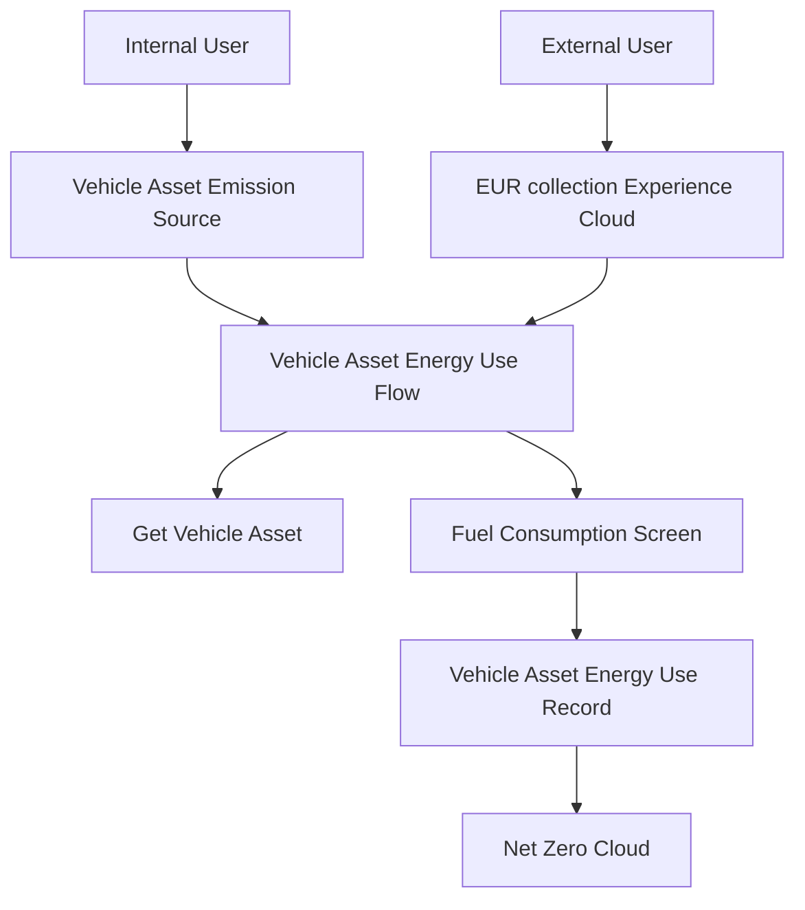

# 🚗 Vehicle Asset Energy Use (NZC)

> **A Net Zero Cloud accelerator that captures vehicle fuel and energy use through a guided screen flow, with an Experience Cloud site for collecting Energy Use Records from external users**

[](https://salesforce.com)
[](https://help.salesforce.com/s/articleView?id=sf.netzero_cloud_intro.htm)
[](https://developer.salesforce.com/docs/platform/lwc/guide)

## 🚀 Quick Deploy

<div align="center">

[](https://githubsfdeploy.herokuapp.com?owner=carlosvl&repo=VehicleEnergyUseFlow-NZC&ref=deploy-mdapi)

**One-click deployment to your Salesforce org**

> **Note:** You'll be prompted to authenticate with your Salesforce org. Digital Experiences must be enabled in the target org before the Experience Cloud site can deploy. Alternatively, use the [Salesforce CLI deployment method](#-option-3-salesforce-cli-deployment) below.

</div>

---

## ✨ Features

### 🚙 **Vehicle Energy Capture**

- **Guided Screen Flow**: Walks users through fuel type, consumption, efficiency, date range, and other emissions factor selection
- **Vehicle Asset Alignment**: Creates `VehicleAssetEnrgyUse` records against a Vehicle Asset Emission Source, the vehicle counterpart to Net Zero Cloud's stationary energy capture
- **Picklist-Driven Units**: Uses org picklists for fuel type, fuel consumption unit, and fuel efficiency unit so values stay consistent with Net Zero Cloud

### 🌐 **External Collection**

- **Experience Cloud Site**: Includes the **EUR collection** LWR site so partners and external users can submit Energy Use Records
- **Branded Workspace**: Ships network settings and branding for the collection community
- **Authenticated Access**: Site is configured for authenticated users with public access enabled

### 🏗️ **Net Zero Cloud Integration**

- **Standard Objects Only**: Writes to Net Zero Cloud vehicle energy-use objects — no custom objects required
- **Emissions Factor Lookup**: Requires an Other Emissions Factor on each submission so carbon accounting can proceed downstream
- **Stationary Counterpart**: Complements the managed **Collect Energy Use Data** flow that ships with Net Zero Cloud for Stationary Assets

---

## 🚀 Getting Started

### 📋 Prerequisites

Before you begin, ensure you have the following:

- ✅ **Salesforce Net Zero Cloud** licensed and configured (Vehicle Asset Energy Use and Vehicle Asset Emission Source available)
- ✅ **Digital Experiences** enabled if you plan to use the EUR collection site (Setup → Digital Experiences → Settings)
- ✅ **Git** installed on your local machine (for CLI deployment)
- ✅ **Salesforce CLI** (latest version recommended) - [Download here](https://developer.salesforce.com/tools/salesforcecli)
- ✅ **Salesforce user** with deployment permissions (System Administrator or equivalent)
- ✅ **Active Salesforce org** (Sandbox, Developer Edition, or Production)

### 🔧 Installation

Choose your preferred deployment method:

#### 🎯 Option 1: One-Click GitHub Deploy _(Recommended)_

Click the **"Deploy to Salesforce"** button above for instant deployment to your org.

#### 📦 Option 2: Workbench Deployment

For environments where GitHub access is restricted:

1. **Download** the pre-built deployment package:
   - Direct download: [VehicleEnergyUseFlow-NZC-Deploy.zip](https://github.com/carlosvl/VehicleEnergyUseFlow-NZC/releases/latest/download/VehicleEnergyUseFlow-NZC-Deploy.zip)
   - Or download from the [GitHub Releases](https://github.com/carlosvl/VehicleEnergyUseFlow-NZC/releases) tab
2. **Navigate** to [Salesforce Workbench](https://workbench.developerforce.com/login.php)
3. **Login** to your target org
4. **Go to** Migration → Deploy
5. **Upload** the zip file and deploy

**Alternative Tools:** You can also deploy using [Salesforce Inspector](https://chrome.google.com/webstore/detail/salesforce-inspector/aodjmnfhjibkcdimpodiifdjnnncaafh) or the [Ant Migration Tool](https://developer.salesforce.com/docs/atlas.en-us.daas.meta/daas/forcemigrationtool_install.htm).

#### 🛠️ Option 3: Salesforce CLI Deployment

For developers who prefer command-line tools:

##### 3.1 Clone the Repository

```bash
git clone https://github.com/carlosvl/VehicleEnergyUseFlow-NZC.git
cd VehicleEnergyUseFlow-NZC
```

##### 3.2 Authorize Your Org

```bash
# For sandbox orgs
sf org login web --alias MyOrg --instance-url https://test.salesforce.com

# For developer or production orgs
sf org login web --alias MyOrg
```

##### 3.3 Deploy the Metadata

```bash
# Deploy all components (Salesforce CLI v2)
sf project deploy start --source-dir force-app --target-org MyOrg

# Or using legacy sfdx command
sfdx force:source:deploy -p force-app -u MyOrg
```

**Note:** This accelerator is compatible with CI/CD tools like Gearset, Copado, Flosum, and Salesforce DevOps Center.

#### ⚡ Post-Deployment Configuration

After deploying with any method above, complete these manual steps:

1. **Confirm Net Zero Cloud Objects**
   - Verify **Vehicle Asset Emission Source** and **Vehicle Asset Energy Use** are visible in your org
   - Create or confirm **Other Emissions Factor** records so the flow lookup has values

2. **Add the Flow to the Vehicle Asset Emission Source Page**
   - Open a Vehicle Asset Emission Source record → **Edit Page**
   - Add a **Flow** component and select `Vehicle Asset Energy Use`
   - Map the page **record ID** to the flow input variable `RecordID` (the name is case-sensitive)
   - Save and activate the page

3. **Enable and Publish Digital Experiences**
   - Setup → **Digital Experiences** → **Settings** → enable Digital Experiences if needed
   - Open **Experience Workspaces** for **EUR collection**
   - Set the site **email sender** to a verified address in your org (source uses a placeholder)
   - Assign member profiles that exist in your org (the retrieved network includes Admin and a partner profile named `nzc partner user`, which you may need to create or replace)
   - **Publish** the site

4. **Grant Object Access to Site Users**
   - Give community or partner users Read on Vehicle Asset Emission Source
   - Give Create and Read on Vehicle Asset Energy Use, including field-level access for fuel, date, and emissions factor fields

5. **Verify the Site Flows**
   - Home and **EUR-lwc** (`/eur-lwc`) both run `Vehicle_Asset_Energy_Use`
   - Optionally add the companion [NZC LLM Bill Ingestor](https://github.com/carlosvl/NZC-LLM-Bill-Ingestor) if you want bill upload
   - Follow the [Usage instructions](#-usage) below to capture your first vehicle energy use record

---

## 🎯 Usage

### 📱 **Capture Energy Use from a Vehicle Asset**

1. **Open** a Vehicle Asset Emission Source record
2. **Run** the **Vehicle Asset Energy Use** flow (from the record page, a quick action, or Flow)
3. **Enter** Name, Other Emissions Factor, Fuel Type, Fuel Consumption, and Fuel Consumption Unit (required)
4. **Optionally enter** Start Date, End Date, Fuel Efficiency, and Fuel Efficiency Unit (defaults to miles per gallon)
5. **Finish** the flow to create a Vehicle Asset Energy Use record linked to that emission source

### 🌐 **Collect Records from the Experience Cloud Site**

1. **Share** the EUR collection site URL with partner or community users
2. **Sign in** as a user whose profile is a member of the site
3. **Complete** the **Vehicle Asset Energy Use** flow on Home or on the **EUR-lwc** page
4. **Confirm** the new Vehicle Asset Energy Use record in Salesforce

### 📊 **What Gets Created**

- **Name**: Record name for the energy use entry
- **Vehicle Asset Emission Source**: Parent vehicle asset (`VehicleAssetEmssnSrcId`)
- **Other Emissions Factor**: Factor used for downstream carbon calculation
- **Fuel Type, Consumption, and Unit**: Required fuel usage
- **Start Date and End Date**: Optional reporting period
- **Fuel Efficiency and Unit**: Optional efficiency (unit defaults to `MILES_PER_GALLON`)

---

## 🏗️ Technical Architecture

This accelerator contains the following metadata:

- **1 Screen Flow** (`Vehicle_Asset_Energy_Use`)
- **1 ExperienceBundle** (`EUR_collection1` — EUR collection LWR site, URL prefix `eurlwr`)
- **1 Network** (`EUR collection`)
- **1 Network Branding** (`cbEUR_collection`)

Net Zero Cloud in a typical org has two asset families for this data model: **Stationary Asset** (managed **Collect Energy Use Data** flow in the `sustainability` package, not included here) and **Vehicle Asset** (the custom flow in this project). The managed stationary flow cannot be retrieved through the Metadata API.

### Architecture Diagram



### 🧩 **Key Components**

| Component | Description |
| ---- | ---- |
| `Vehicle_Asset_Energy_Use` | Screen flow that looks up a Vehicle Asset Emission Source and creates a Vehicle Asset Energy Use record |
| `EUR collection` | Experience Cloud LWR site for external Energy Use Record collection |
| `VehicleAssetEmssnSrc` | Net Zero Cloud Vehicle Asset Emission Source — parent record passed in as `RecordID` |
| `VehicleAssetEnrgyUse` | Net Zero Cloud Vehicle Asset Energy Use — record created by the flow |
| `OtherEmssnFctrId` | Required Other Emissions Factor lookup on the energy use record |

---

## 🤝 Contributing

We welcome contributions to improve Vehicle Asset Energy Use (NZC)! Please follow these steps:

1. **Fork** the repository
2. **Create** a feature branch (`git checkout -b feature/amazing-feature`)
3. **Commit** your changes (`git commit -m 'Add amazing feature'`)
4. **Push** to the branch (`git push origin feature/amazing-feature`)
5. **Open** a Pull Request

See [CONTRIBUTING.md](CONTRIBUTING.md) for the full guide, including the Salesforce CLA. This project follows the [Code of Conduct](CODE_OF_CONDUCT.md).

### 📝 **Development Guidelines**

- Follow [Salesforce coding standards](https://developer.salesforce.com/docs/atlas.en-us.apexcode.meta/apexcode/apex_classes_best_practices.htm)
- Include comprehensive test coverage (>75%) for any Apex you add
- Update documentation for new features (`README.md`, `wiki/index.md`, `REPOSITORY_SUMMARY.md`)
- Test thoroughly in multiple org types (Sandbox, Developer Edition)
- Keep Experience Cloud page components aligned with metadata that actually ships in this package

---

## 📄 License

This project is licensed under the **Apache License 2.0** - see [LICENSE.md](LICENSE.md) and [LICENSE.txt](LICENSE.txt) for details.

---

## 🐛 How to Report Bugs

Found a bug or have a feature request? Please report it via [GitHub Issues](https://github.com/carlosvl/VehicleEnergyUseFlow-NZC/issues).

When reporting bugs, please include:

- Steps to reproduce the issue
- Expected vs. actual behavior
- Salesforce org version and edition
- Whether Digital Experiences was enabled before deploy
- Screenshots or error messages (if applicable)

## 🆘 Support

- 📚 **Documentation**: Start with [wiki/index.md](wiki/index.md) and [REPOSITORY_SUMMARY.md](REPOSITORY_SUMMARY.md)
- 🐛 **Issues**: Report bugs via [GitHub Issues](https://github.com/carlosvl/VehicleEnergyUseFlow-NZC/issues)
- 🔒 **Security**: Report vulnerabilities via [SECURITY.md](SECURITY.md)
- 🤝 **Contributing**: See [CONTRIBUTING.md](CONTRIBUTING.md)
- 📧 **Contact**: Reach out to the maintainers for enterprise support

## ⚠️ Disclaimer

**This accelerator is open-source, not an official Salesforce product, and is community-supported.** Salesforce does not provide official support for this accelerator. Use at your own risk and test thoroughly in a sandbox environment before deploying to production.

---

<div align="center">

**Made with ❤️ for the Salesforce Community**

⭐ **Star this repo** if you find it helpful!

</div>
